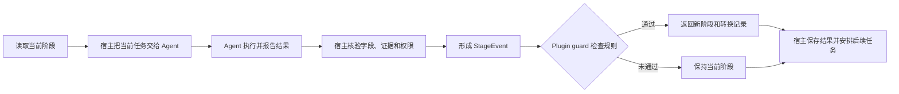
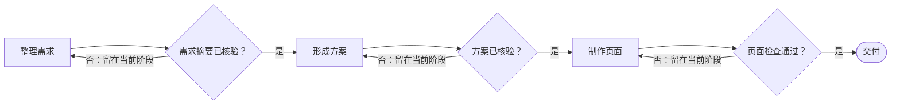
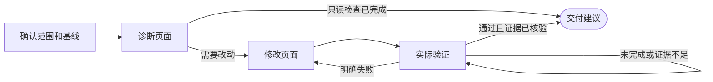
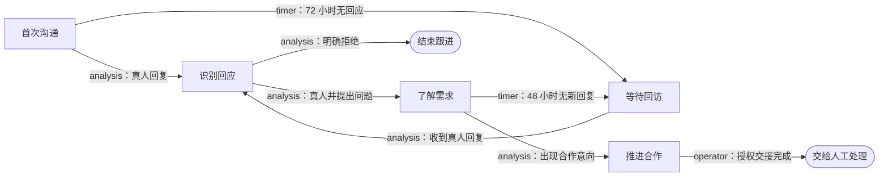

# agent-stage-kit

基于 XState 5 的 Agent 阶段门禁库。它接收“当前阶段”和“宿主已核验的事件”，按业务规则计算是否允许流转，并返回新阶段与转换记录。

**Agent 负责理解和执行当前任务；宿主负责核验事实；agent-stage-kit 负责按固定规则开门。** Agent 可以报告结果，但不直接指定下一阶段。

## 一次阶段判断怎么发生



“没有通过”不等于失败后自动重试。内核只返回状态判断；宿主决定是否补充证据、再次调用 Agent、等待外部事件或结束任务。

## 三个场景：从直线推进到多事件流程

### 场景一：把页面交付拆成有验收条件的阶段

先从最简单的情况开始：Agent 依次整理需求、形成方案、制作页面。每一步都要由宿主验收后，才能进入下一步。



此时它就是线性流水线：每条边有一个明确条件。假设宿主核验后提交下面的事件：

```js
{
  id: "review-001",
  type: "review",
  observedAt: "2026-10-04T00:00:00Z",
  facts: { "brief.approved": true }
}
```

Plugin guard 判断当前边是否引用 `brief.approved`，以及值是否为 `true`。条件满足，`advance()` 返回“形成方案”；条件不满足或字段缺失，实例保持“整理需求”。字段名可以是 `brief.approved`、`ready` 或任意业务键；框架不靠前缀猜含义，业务 Plugin 决定哪些字段能开哪道门。

可以运行 [最小线性示例](examples/linear.mjs)：它展示 Node、Edge、Plugin guard、Event 和 `advance()` 的完整关系。

### 场景二：界面质量检查需要返工，而不只是往前走

真实制作通常不是单向流程。检查失败要回到修改；检查结果只有“部分完成”或缺少证据时，应停在检查阶段，而不能被 Agent 的一句“好了”推进到交付。



这里出现了两种门禁：结果明确失败时走返工边；结果未知、未完成或证据不足时不流转。`passed: true` 之类字段只是输入，宿主要先确认它来自实际检查，再提交事件。字符串形式的证据本身不会让框架确认检查真的发生过。

对应的可运行示例是 [质量验收示例](examples/quality-gate.mjs)，它包含只读评审、修改、验证、返工和交付条件；[返工示例](examples/rework.mjs) 则用更短的流程展示失败后回到旧阶段。

### 场景三：客户沟通流程会收到 Agent、计时器和人工操作的事件

长期沟通任务不只有 Agent 分析。Agent 可以报告对方是否回复、是否提问；宿主的计时器可以报告是否超时；人工操作入口可以在权限核验后报告接管完成。这些事件进入同一状态图，但由业务规则决定哪些事件和事实能够流转。



例如一次经宿主核验的分析事件可以带多个普通字段：

```js
{
  id: "analysis-042",
  type: "analysis",
  observedAt: "2026-10-04T00:00:00Z",
  facts: {
    humanReplied: true,
    isHuman: true,
    asksQuestion: true
  }
}
```

若当前状态在“首次沟通”，且定义启用了 `cascade: true`，同一事件可以先让流程进入“识别回应”，再按另一条 guard 进入“了解需求”。`transitions` 会记录每一跳。超时事件和人工事件则由宿主各自生成；人工事件进入内核前，宿主仍须检查操作者权限。

这个场景展示了 Kit 与业务系统的边界：Kit 可以检查事件类型和业务 guard，也可以记录转移；它不启动计时器、不读取聊天记录、不验证消息证据、不认证操作者，也不创建 Agent 任务。

## 把场景映射到代码

| 概念             | 含义                         | 例子                                     |
| ---------------- | ---------------------------- | ---------------------------------------- |
| Definition       | 一张状态图和它的版本         | 阶段节点、允许的转换边、是否级联         |
| Node             | 当前工作阶段                 | 整理需求、实际验证、等待回访             |
| Edge             | 允许的一次阶段转换           | 验收通过后从“整理需求”进入“形成方案”     |
| Plugin guard     | 业务提供的确定性门禁代码     | `facts["brief.approved"] === true`       |
| StageEvent       | 宿主提交的一次已核验输入     | Agent 分析结果、计时器结果、人工操作结果 |
| Instance         | 一项具体工作的当前状态       | 当前 `nodeId`、revision、业务 data       |
| TransitionRecord | 为什么、何时、从哪到哪的记录 | 本次事件命中的边、reason、定义版本       |

最常见的调用顺序如下：

```js
import {
  createRegistry,
  createInstance,
  advance,
  projectContext,
} from "agent-stage-kit";
import { plugin, definition } from "agent-stage-kit/plugins/quality-gate";

const registry = createRegistry([plugin]);
const now = new Date().toISOString();

// 首次建立时创建；后续请求应从宿主存储读取已有 instance。
const instance = createInstance(definition, registry, "page-task-001", now, {
  mode: "edit",
});

// 实际接入时，宿主先运行检查并核验证据，再构造这个 event。
const result = advance(
  definition,
  instance,
  {
    id: "verify-001",
    type: "verification",
    observedAt: now,
    facts: {
      result: "verified",
      passed: true,
      evidence: ["check-run-001"],
    },
  },
  registry,
  now,
);

console.log(result.instance.nodeId); // deliver
console.log(result.transitions); // 本次命中的阶段转换记录
const nextTaskContext = projectContext(definition, result.instance, registry);
```

`facts` 是普通 JSON 字段集合。框架不识别字段名或前缀，也不自动判断字段是否能被边引用；本例的质量验收 Plugin 定义了自己需要的字段和规则。宿主还可以在调用前按自己的契约检查字段集合、类型、来源、证据和权限。

## 运行示例和检查

要求 Node.js 22 或更高版本。克隆仓库后：

```sh
npm install --ignore-scripts
npm run demo:linear
npm run demo:quality
npm run check
```

`npm run demo` 会依次运行六个通用示例；每个示例都会断言关键状态结果。也可以按主题单独运行：

| 命令                      | 示例                                          | 学到什么                       |
| ------------------------- | --------------------------------------------- | ------------------------------ |
| `npm run demo:linear`     | [linear.mjs](examples/linear.mjs)             | 顺序阶段和自定义 guard         |
| `npm run demo:rework`     | [rework.mjs](examples/rework.mjs)             | 失败后回到前一阶段             |
| `npm run demo:quality`    | [quality-gate.mjs](examples/quality-gate.mjs) | 证据门禁、等待、返工和交付     |
| `npm run demo:routing`    | [routing.mjs](examples/routing.mjs)           | 分支优先级、级联、宿主计时事件 |
| `npm run demo:checkpoint` | [checkpoint.mjs](examples/checkpoint.mjs)     | JSON 检查点、重开、幂等重放    |
| `npm run demo:migration`  | [migration.mjs](examples/migration.mjs)       | 升级定义并显式映射旧阶段       |

演示输入都是模拟数据，没有连接真实 Agent、浏览器、消息平台或业务数据库。

## 接入已有宿主

1. **把工作拆成阶段。** 为每个阶段建立 Node，为每个允许的下一步建立 Edge；用稳定 ID 标识节点。
2. **定义业务 guard。** guard 读取宿主提交的 event，并返回 `{ pass, reason }`。字段字典、字段来源与验收证据由业务和宿主定义。
3. **把当前阶段交给 Agent。** 宿主可通过 `projectContext()` 生成当前阶段的任务说明；Agent 只负责完成这项工作并报告结果。
4. **在宿主验收后创建事件。** 事件要有稳定的 `id`、`type`、`observedAt` 和 `facts`。不要把未经核验的 Agent 自报阶段当成转换指令。
5. **调用 `advance()`。** 保存返回的 `instance`、`transitions` 和事件回执；然后由宿主决定是否排入下一项 Agent 工作。
6. **在服务端事务内持久化。** 使用宿主自己的数据库、事务和 revision/CAS 处理并发与幂等。`advance()` 是纯计算，不替宿主保存数据或去重。

内核使用 XState 5 计算状态转移，但业务通过 Definition 和 Plugin 扩展，无须把 Agent 任务改写成 XState actor。线性流水线只是状态图的一种配置，返工、自环等待、终态和分支也能放在同一张图里。

## 存储和运行边界

- **不要求 SQLite。** Kit 内核不连接数据库。服务端继续使用宿主已有的数据库；短期本地任务可使用 `JsonStore` 保存 JSON 检查点，也可通过 CLI 查看和推进。
- **不负责执行 Agent。** 宿主选择模型、组织提示词、调用工具、决定何时创建下一项任务。
- **不负责事实真实性。** guard 只检查提交进来的值；宿主负责核验产物、消息证据、权限和来源。
- **不提供调度服务。** 超时由宿主的定时任务形成 `timer` 事件后提交。
- **事件推进可审计。** 每次 `advance()` 都增加 revision；没发生转换时也会消耗一个 revision。`decisions` 说明检查过哪些边，`transitions` 记录实际发生的转换。
- **级联有边界。** `cascade: true` 允许同一事件连续通过多条边；同一事件跨阶段形成循环时拒绝。跨事件返工循环则可正常使用。
- **定义更新要显式迁移。** Definition 有版本和 hash；迁移需要提供明确的旧阶段到新阶段映射。

本地构建后可查看 CLI：

```sh
npm run build
node dist/cli.js --help
```

需要独立进程检查点时，可通过 CLI 的 `init`、`context`、`advance`、`show` 和 `migrate` 命令操作。JSON 检查点适合本地短期任务，不提供跨文件事务、无限期历史压缩或外部副作用的 exactly-once 保证。
