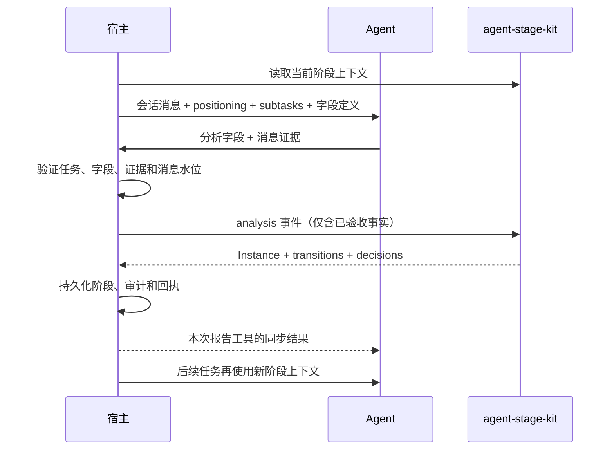

# 用 agent-stage-kit 实现主动销售流程

这份独立示例把一套闲鱼主动销售流程映射为 agent-stage-kit 的状态图、Plugin 和事件。可运行代码在 [销售流程示例](../examples/sales-workflow.mjs)。

示例只导入 agent-stage-kit 和 Node.js 标准库，不依赖具体业务系统。销售配置按一套业务规则整理（2026-10-04），用于演示接法，不代表任何线上启用的流程行或版本。Demo 使用模拟分析结果和临时 JSON 文件，不会调用 Agent、闲鱼、MySQL 或真实消息。

## 运行

要求 Node.js 22 或更新版本。在 agent-stage-kit 目录运行：

    npm run demo:sales-workflow

脚本先编译库，然后依次演示：

1. 真人回复并开始提问：首发触达 → 响应甄别 → 需求咨询，同一事件连续走两跳。
2. 讨论价格后进入意向深化，确认合作后进入准备成交。
3. 宿主生成运营事件，走完配置里的“运营接管完成”规则。
4. 商家转到微信后，演示一条明确标注的宿主人工恢复边。
5. 宿主提交超时事实，首发触达 → 沉默。
6. 在需求咨询连续四次分析都没有阶段变化，进入沉默。

输出中的 contextForNextAgentTask 是从完整 projectContext 投影出的当前阶段摘要，供后续 Agent 任务使用；每次 dispatch 的 transitions 是这次事件的实际流转路径。代码会断言示例的阶段结果，末尾应显示“已验证”。

## 谁负责哪一段

| 参与方               | 责任                                                                                                                    |
| -------------------- | ----------------------------------------------------------------------------------------------------------------------- |
| Agent                | 阅读会话与当前阶段任务说明，提交带消息证据的事实字段；不写阶段、不调度超时、不执行运营权限操作。                        |
| 宿主                 | 领取任务，提供会话/阶段/字段定义，验收 Agent 回执与证据；从消息台账计算超时；负责权限、事务和下一任务调度。             |
| agent-stage-kit      | 把已经验收的事实事件应用到流程定义，返回新 Instance、逐跳转换记录和条件判断结果。                                       |
| JsonStore（本 Demo） | 在本地 JSON 文件中保存定义、会话 Instance、事件回执和转换历史。生产宿主可用自己的数据库事务适配，不需要替换业务数据库。 |

Agent 的报告工具收到的阶段结果是一次同步响应：宿主调用 JsonStore.dispatch()（生产环境则是在事务中调用内核），保存成功后把裁剪过的结果回给 Agent。结果不会自行启动下一轮推理。当前销售分析任务会随报告完成；外层任务循环再领取新任务，有任务时才按新阶段生成上下文。stage-kit 本身不运行 Agent 或任务队列。

## 当前销售流程如何映射

阶段名、规则顺序和条件字段沿用当前源码 seed。规则数组顺序就是同一阶段内的优先级。

| 阶段     | 自动条件与出口                                                                                                                                      |
| -------- | --------------------------------------------------------------------------------------------------------------------------------------------------- |
| 首发触达 | 真人回复 → 响应甄别；中心判断首发后满 72 小时且无入站 → 沉默                                                                                        |
| 响应甄别 | 真人并提问 → 需求咨询；明确拒绝 → 已拒绝；引导站外 → 已转微信；自动回复 → 留在本阶段                                                                |
| 需求咨询 | 谈价格 → 意向深化；明确拒绝或回避次数 ≥2 → 已拒绝；引导站外 → 已转微信；中心判断我方最后回复后满 48 小时且无入站 → 沉默；连续 4 次分析无流转 → 沉默 |
| 意向深化 | 同意合作或询问上架细节 → 准备成交；明确拒绝 → 已拒绝；引导站外 → 已转微信                                                                           |
| 准备成交 | “运营接管完成”是人工规则，配置目标为已拒绝                                                                                                          |
| 已转微信 | terminal: "可复活"；没有自动出口，站内返回由运营处理                                                                                                |
| 沉默     | terminal: "可复活"；获得真人回复 → 响应甄别                                                                                                         |
| 已拒绝   | terminal: true，绝对终态，没有流程出口                                                                                                              |

这里保留了当前 seed 的人工规则目标“已拒绝”，虽然它看起来不像“运营接管完成”通常代表的状态。实施前应以当时生效的 playbook 行核实该值，不能因为示例看起来不顺就悄悄改写业务含义。

当前 playbook 对“已转微信”只说明由运营处理站内返回，没有定义自动转换目标。Demo 额外加了一条标注为适配器策略的边：运营确认商家回到站内后进入“响应甄别”。目标阶段是便于演示的明确选择，不属于原始 playbook；接入时要由业务决定允许的目标，不能把这条边伪装成现有自动规则。

## 配置怎么变成状态图

可运行文件中的 salesPlaybook 是完整的示例配置：每个阶段包含 name、positioning、subtasks、transitions，需要时再加 terminal 或 stallExit。映射函数据此生成 stage-kit 的 Definition：

- 每个阶段变成一个 Node，id 使用稳定阶段名。
- 每条带 condition 的规则变成一条 Edge，guard 参数保存 when 和 condition。
- 保留源数组顺序，因而保留优先级。
- manual 规则变为 operator 事件 guard；Agent 分析事件不会通过这个 guard。
- Demo 另加的“已转微信 → 响应甄别”人工边明确标为宿主适配策略，未写回示例 playbook。
- stallExit 追加为该阶段的最后一条 Edge，因此普通销售规则优先。
- 只有 terminal === true 映射为 stage-kit 的绝对终态。“可复活”字符串只作为上下文分类，不设置 XState final node；否则沉默阶段就无法通过真人回复复活。
- cascade: true 允许同一分析事件连续命中下一阶段规则。例如 pb_human_replied、pb_is_human、pb_is_asking 同时已验收时，可从首发直接连续进入需求咨询。

Plugin 的 condition guard 实现 eq、ne、gte、lte、in、exists。字段缺失或 null 都不命中；数字比较兼容 "2" 这样的数字字符串。示例沿用销售业务的 `pb_human_replied`、`ctx_hours_since_last_out` 等字段名，但这些前缀对 agent-stage-kit 没有特殊含义。内核把所有 `facts` 键统一当作普通 JSON 数据；业务字段定义、宿主验收规则和 Plugin guard 才决定字段的含义、允许的生产方及如何用于门禁。此示例的适配器把普通规则作为 `analysis` 事件处理，超时规则显式配置为 `timeout`；事件分类不靠字段名前缀猜测。详细解释见[从最小例子理解 agent-stage-kit](agent-stage-kit-from-zero.md)。

Plugin 的 onEvent 在每个分析事件上增加 analyzeCount；阶段实际改变后，onTransition 清零。于是需求咨询第四次无流转分析会命中 stallExit。Agent 的阶段上下文由 projectContext() 投影 positioning、subtasks 和非人工规则；人工规则留给运营界面或宿主操作入口。

## Agent 报告什么，宿主提交什么

Agent 的原始回答不是状态机输入。宿主先检查任务凭证、字段是否属于已冻结的字段定义、字段值是否合法、证据是否来自本任务可见的消息以及消息水位是否匹配。只有验收通过的字段才组成 facts：

    {
      id: "conversation-123-analysis-456",
      type: "analysis",
      observedAt: "2026-10-01T01:00:00Z",
      facts: {
        pb_human_replied: true,
        pb_is_human: true,
        pb_is_asking: true
      },
      evidence: [
        { type: "message", ref: "msg-101", quote: "真人回复示例" },
        { type: "message", ref: "msg-102", quote: "想了解合作方式" }
      ]
    }

id 应稳定对应一次已验收的报告，使宿主能够做幂等处理。evidence 是 Agent 引用的来源；它本身不会证明消息真实存在，宿主需要核对来源。Demo 的 acceptedAnalysisEvent() 仅作最小模拟，生产宿主仍需执行字段字典和证据校验。

若条件字段是 null 或没有提交，对应条件为假。若字段字典把数字编码为字符串，例如 `pb_evasion_count: "2"`，数值比较仍会按 2 判断。本示例的业务契约规定：`analysis` 事件中的事实由 Agent 报告并经宿主验收，`timeout` 事件中的事实由宿主从消息台账计算；这项权限区分来自业务配置和事件入口，不是字段名前缀或 agent-stage-kit 的内置规则。

超时扫描由宿主的调度器执行：它查询最后一次我方出站和之后的入站消息，计算 ctx_hours_since_last_out、ctx_inbound_since_last_out，再提交 type: "timeout" 事件。不是让 Agent 猜测已经过了多少小时，也不是让 stage-kit 自己启动定时器。

运营操作同样由宿主生成 type: "operator" 事件。示例中的 operatorApproved 只是演示 guard 输入，不是安全凭证；真实宿主必须在 API 层认证操作者、检查权限并记审计，Agent 报告接口不能提交这类事件。

已拒绝配置为绝对终态，stage-kit 会把它编译成 XState final node，因此普通事件不能让它离开。源码提到的人工解禁不在 playbook 规则里。若业务需要解禁，应发布新 Definition 版本，明确移除该节点的绝对终态标记并配置经过授权的人工边，再通过显式 migrate 把实例迁入新版本；不要让 Agent 伪造一个分析事实来解禁。

## “新阶段 + 转换记录”长什么样

在示例中，JsonStore.dispatch() 同步返回 AdvanceResult。真人回复并提问时，核心结果形如：

    {
      "instance": {
        "nodeId": "需求咨询",
        "revision": 1
      },
      "transitions": [
        { "from": "首发触达", "to": "响应甄别", "reason": "对方回了一条真人消息" },
        { "from": "响应甄别", "to": "需求咨询", "reason": "对方是真人且开始提问" }
      ],
      "decisions": ["本次检查过的 guard 及其 pass/reason"]
    }

实际对象还包括定义版本、事件 ID、时间、Edge ID 等审计字段。上面的精简对象方便人读，不是完整 JSON Schema。JsonStore 会同时保存 Instance、转换记录和事件回执；相同事件 ID 与载荷重放时返回原结果，不重复应用。

宿主可以把工具响应裁剪成下面这样的 API 结果：

    {
      "accepted": true,
      "replayed": false,
      "stageFrom": "首发触达",
      "stageTo": "需求咨询",
      "transitions": [
        { "from": "首发触达", "to": "响应甄别" },
        { "from": "响应甄别", "to": "需求咨询" }
      ],
      "revision": 1
    }

这个外层对象由宿主定义；agent-stage-kit 直接返回的是 AdvanceResult。宿主不需要把定义 hash、内部 reducer data 或权限数据传给 Agent。

## 接入真实服务时保留的边界

Demo 用 JsonStore 展示本地单写者和检查点。若由实际销售业务服务接入，stage-kit 只替换“已验收事件 → 下一阶段”的判定部分：

1. 仍由现有任务服务领取任务、提供消息和字段定义。
2. 仍由宿主校验 Agent 报告并计算超时/人工事件。
3. 在现有数据库事务中读取 Instance、核对事件幂等键与预期 revision、应用状态转移、保存新 Instance/转换记录/报告回执，再一起提交。
4. 复用宿主现有的消息发送权限、审核和任务调度逻辑。

现有业务系统的阶段记录可能比 stage-kit Instance 更精简：真实落库需要保存定义版本/hash、节点、revision、进入时间和 reducer data，并确定事件回执和转换记录如何持久化；还要处理现存阶段数据迁移。此示例没有 MySQL 适配器，也没有改写或替换业务系统的数据库功能。

有两个语义要在真实接入前对齐：

- 当前超时扫描是一次只走一跳；stage-kit 的 cascade 是定义级开关，会让任何事件在同一事件里继续级联。本流程的超时目标“沉默”只有 pb_ 复活规则，guard 会阻止 timeout 事件继续通过它，因而示例路径是一跳。若后续在超时目标上增加 ctx_ 出口，需要用测试确认或扩展宿主适配策略。
- 此示例的级联以阶段数为上限；stage-kit 检测到同一事件的跨节点循环会抛出 CYCLE。当前 seed 的自动边不构成跨阶段循环；未来修改规则时仍应审查循环。

## 下一步阅读

- [可运行完整配置与模拟宿主](../examples/sales-workflow.mjs)
- [通用阶段模型和 API](../README.md)
- [检查点与幂等 demo](../examples/checkpoint.mjs)
